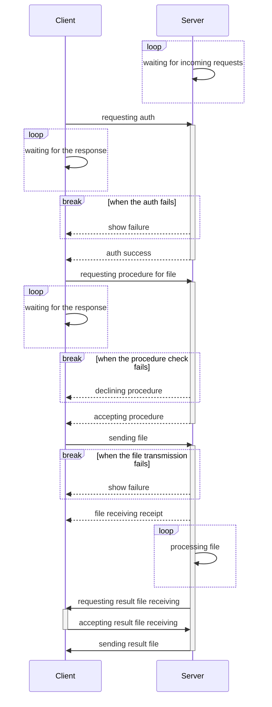

# kontor

[](https://github.com/psf/black)
[](https://pypi.org/project/kontor)
[](https://pypi.python.org/pypi/kontor/)
[](https://github.com/morwy/kontor/actions/workflows/python-tests.yml)

> [!WARNING]
> Currently kontor is in pre-alpha stage, providing no secure way of transferring the files!

kontor is a client-server bundle that is designed to execute pre-defined procedures on server by request of authorized client.

Most of the class names are based on the word-play around white-collar office work:

- **Bureau** is a server-side frontline service handling incoming requests and redirecting them to appropriate **Clerk** for processing
- **Clerk** is a server-side main request processing entity
- **Cubicle** is temporary storage for processing files received from an applicant
- **Applicant** is a client, requesting a procedure and waiting for the results
- and so on...

## Versioning

kontor follows semantic versioning (SemVer) principles. Version numbers are in the format `MAJOR.MINOR.PATCH.DEV` where:

- `MAJOR` version is incremented when new functionality or bug fixes are added on the protocol level in a ***non-backwards-compatible*** manner OR there are incompatible API changes
- `MINOR` version is incremented when new functionality or bug fixes are added in a ***backwards-compatible*** manner
- `PATCH` version is ignored since kontor releases do not happen that often, set to `0` for all releases
- `DEV` version is incremented for development releases and is not intended for production use, may be in format `devN`, e.g. `dev1`, `dev2`, `dev3`, etc.

## Installation

**kontor** can be installed or upgraded by simply calling **pip** command:

```bash
pip install kontor --upgrade
```

## Requirements & dependencies

Minimum Python version supported is 3.8.

kontor relies on following external packages:

- **dacite**

## Examples

### Bureau

#### General

1. Create a `start_server.py` file and add following text there (this file is also present in `examples/server` repo folder):

    ```python
    #!/usr/bin/env python
    import logging
    import os
    import signal
    import sys

    from kontor.bureau import Bureau


    def shutdown_signal_handler(sig, frame):
        logging.critical("Caught SIGINT signal, bureau will be shut down.")
        sys.exit(0)


    if __name__ == "__main__":
        #
        # Catch Ctrl+C signal for notifying about bureau shutdown.
        #
        signal.signal(signal.SIGINT, shutdown_signal_handler)

        bureau = Bureau(os.path.dirname(os.path.realpath(__file__)))
        bureau.start()
    ```

2. Create `server_configuration.json` file next to `start_server.py`. Example configuration may look like following (detailed description of each field is provided in [Configuration files breakdown](#configuration-files-breakdown) section):

    ```json
    {
        "ip_address": "localhost",
        "port": 5690,
        "chunk_size_kilobytes": 256,
        "client_idle_timeout_seconds": 30,
        "max_storage_period_hours": 0,
        "max_parallel_connections": 100,
        "max_consequent_client_procedures": 1,
        "max_grace_shutdown_timeout_seconds": 30,
        "forced_ssl_usage": false,
        "certificate_path" : "~/test_certificate.cer",
        "certificate_key_path" : "~/test_certificate.key",
        "procedures": {
            "test_procedure": {
                "name": "test_procedure",
                "operation": "echo \"this is a test procedure\"",
                "error_codes": [
                    1
                ],
                "max_repeats_if_failed": 3,
                "time_seconds_between_repeats": 10
            }
        }
    }
    ```

3. Create `server_users.json` file next to `start_server.py`. Example configuration may look like following (detailed description of each field is provided in [Configuration files breakdown](#configuration-files-breakdown) section):

    ```json
    [
        {
            "username": "test_user",
            "password_hash": "test_password_hash",
            "allowed_procedures": [
                "test_procedure"
            ]
        }
    ]
    ```

#### Windows-specific

It is possible to run Bureau as service on Windows by using [WinSW v3](https://github.com/winsw/winsw/tree/v3) as bundled tool.

1. Create a new folder, e.g. `C:\kontor`
2. Download WinSW executable of suitable version
3. Put it to `C:\kontor` folder
4. Rename it to `kontor.exe`
5. Create a `kontor.xml` configuration file and add following text there:

    ```xml
    <service>
        <id>kontor</id>
        <name>kontor</name>
        <description>This service runs kontor as Windows service.</description>
        <executable>python</executable>
        <arguments>start_server.py</arguments>
        <log mode="none" />
        <onfailure action="restart" />
    </service>
    ```

6. Create kontor-specific files according to the instructions in [General](#general) section and put them to `C:\kontor` folder.
7. Install kontor as a service by calling following command in CMD:

    ```batch
    kontor install
    ```

8. Start service by calling the command:

    ```batch
    kontor start
    ```

9. [WinSW CLI instruction](https://github.com/winsw/winsw/blob/v3/docs/cli-commands.md) has a lot more of useful commands that can be applied. Most useful though would be following:

    ```batch
    kontor stop
    ```

    ```batch
    kontor restart
    ```

    ```batch
    kontor uninstall
    ```

## Configuration

### Configuration files breakdown

#### server_configuration.json

Configuration file is a JSON file with structure mentioned in [General](#general) section. It contains following fields:

- `ip_address` - The IP address on which the bureau server listens for incoming connections. Default is `localhost`.
- `port` - The port number on which the bureau server listens for incoming connections. Default is `5690`.
- `chunk_size_kilobytes` - The size of data chunks in kilobytes used for file transmission. Default is `256`.
- `client_idle_timeout_seconds` - The time in seconds after which an idle client connection is closed by the bureau. Default is `30`.
- `max_storage_period_hours` - The maximum period in hours for which the bureau can store received files before they are automatically deleted. A value of 0 means no automatic deletion. Default is `0`.
- `max_parallel_connections` - The maximum number of parallel client connections that the bureau can handle simultaneously. Default is `100`.
- `max_consequent_client_procedures` - The maximum number of consequent procedures that a single client can execute before being disconnected by the bureau. A value of 0 means no limit. Default is `1`.
- `max_grace_shutdown_timeout_seconds` - The maximum time in seconds that the bureau waits for ongoing procedures to complete during a graceful shutdown before forcefully terminating them. Default is `30`.
- `forced_ssl_usage` - A boolean flag indicating whether SSL/TLS encryption is enforced for all communications between the applicant and the bureau. If set to True, all connections must use SSL/TLS; if False, SSL/TLS is optional. Default is `false`.
- `certificate_path` - The file path to the SSL/TLS certificate used by the bureau for encrypted communications. This should be provided if forced_ssl_usage is True or if SSL/TLS is desired. Default is empty string.
- `certificate_key_path` - The file path to the private key corresponding to the SSL/TLS certificate used by the bureau. This should be provided if forced_ssl_usage is True or if SSL/TLS is desired. Default is empty string.
- `procedures` - A dictionary mapping procedure names (strings) to their corresponding ProcedureProtocol objects, representing all procedures available for execution by applicants. Each ProcedureProtocol object contains the following fields:
  - `name` - The name of the procedure. Also used as a key in the `procedures` dictionary. Required field.
  - `operation` - A description of the operation performed by the procedure. This can be a command, script, or any other operation that the bureau will execute when the procedure is requested. Required field. May contain following macros:
    - `<FILE_NAME>` - The path to the input file received from the applicant. It will be replaced with the actual file path when the procedure is executed.
    - `<FILE_COPY>` - The path to a copy of the input file received from the applicant. This copy is created in the cubicle and can be used for operations that require a separate file. It will be replaced with the actual file path of the copy when the procedure is executed.
  - `timeout_in_seconds` - The maximum time in seconds that the procedure can take to complete. Default is `60` seconds.
  - `error_codes` - A list of error codes that will cause the procedure to be considered as failed. If the procedure returns an error code that is not in this list, it will be considered as successful. Default is an empty list, meaning that any exit code will be considered a success.
  - `max_repeats_if_failed` - The maximum number of times the clerk can repeat the procedure if it fails. Default is `3`.
  - `time_seconds_between_repeats` - The time in seconds that the clerk must wait between repeat attempts of the procedure after a failure. Default is `10`.
  - `time_seconds_between_procedures` - The time in seconds that the clerk must wait between executing this procedure and any subsequent procedure, regardless of success or failure. A value of 0 means no waiting time is required between procedures. Default is `0`.

#### server_users.json

Users file is a JSON file with structure mentioned in [General](#general) section. It is a list of dictionaries, each representing an applicant with the following fields:

- `username` - The username of the applicant. Required field.
- `password_hash` - The hashed password of the applicant. Password is hashed with SHA512 and stored as a string of hexadecimal digits. Required field.
- `allowed_procedures` - A list of procedure names as strings that the applicant is allowed to execute. These names must correspond to the keys in the `procedures` dictionary of the `server_configuration.json` file. Required field.

### Enabling SSL connection

#### Linux (Ubuntu)

1. Install **ca-certificates** application, if needed:

    ```bash
    sudo apt-get install -y ca-certificates
    ```

2. Generate a Certificate Authority (CA):

    ```bash
    openssl genrsa -out kontor.key 2048
    ```

3. Self-sign the newly created Certificate Authority (CA):

    ```bash
    openssl req -x509 -new -nodes -key kontor.key -sha256 -days 365 -out kontor.crt
    ```

4. Copy newly generated certificate to local certificate folder:

    ```bash
    sudo cp kontor.crt /usr/local/share/ca-certificates
    ```

5. Update current list of used certificates:

    ```bash
    sudo update-ca-certificates
    ```

6. Add `kontor.crt` and `kontor.key` to server configuration with `forced_ssl_usage` set to `true`:

    ```json
        ...
        "forced_ssl_usage": true,
        "certificate_path" : "kontor.crt",
        "certificate_key_path" : "kontor.key",
        ...
    ```

## Bureau-applicant interaction flowchart (version 1)

<center>



</center>
